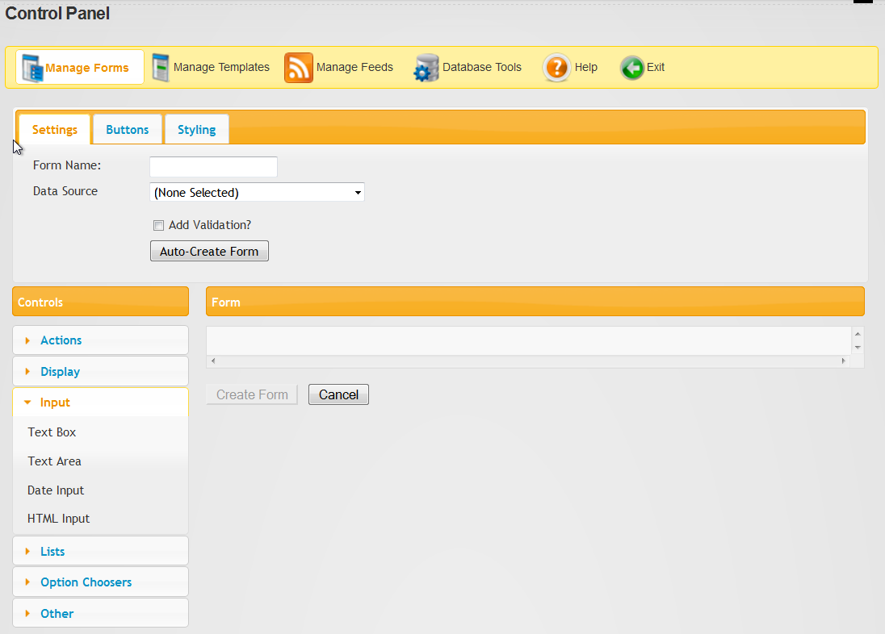
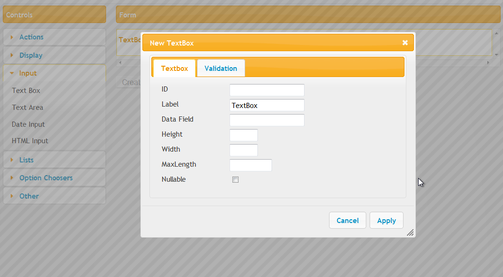
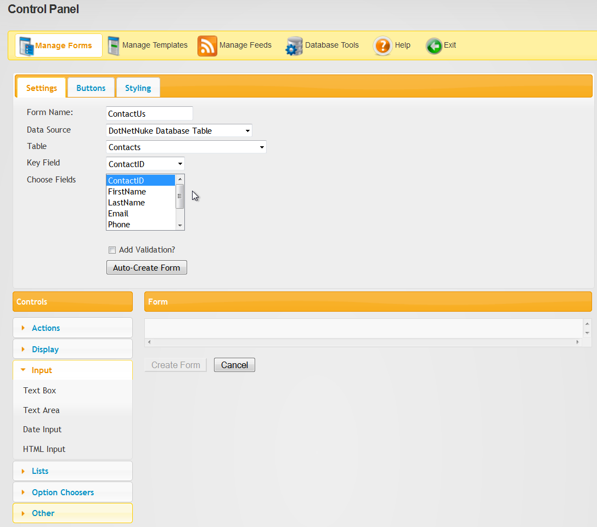
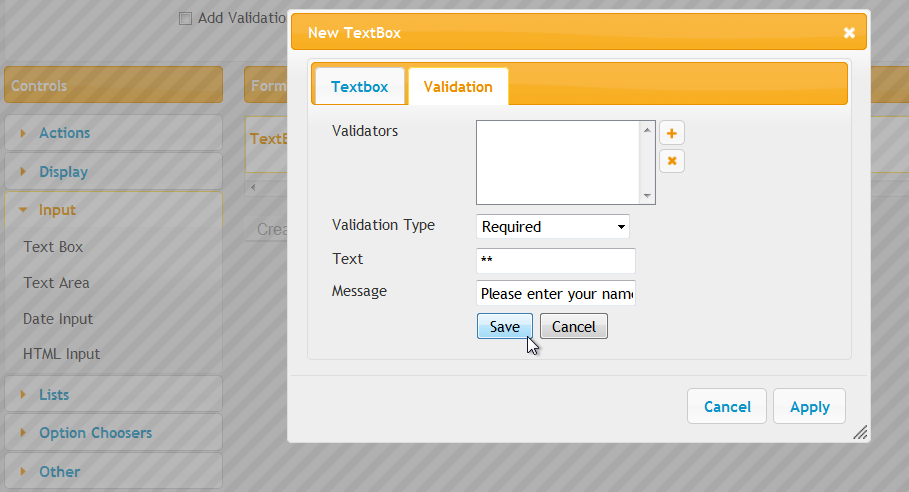
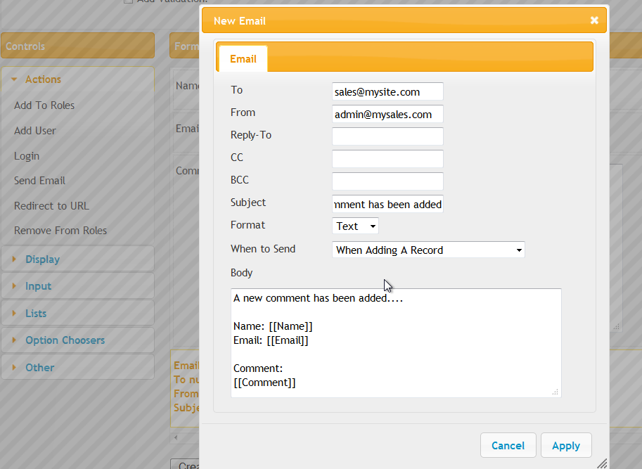
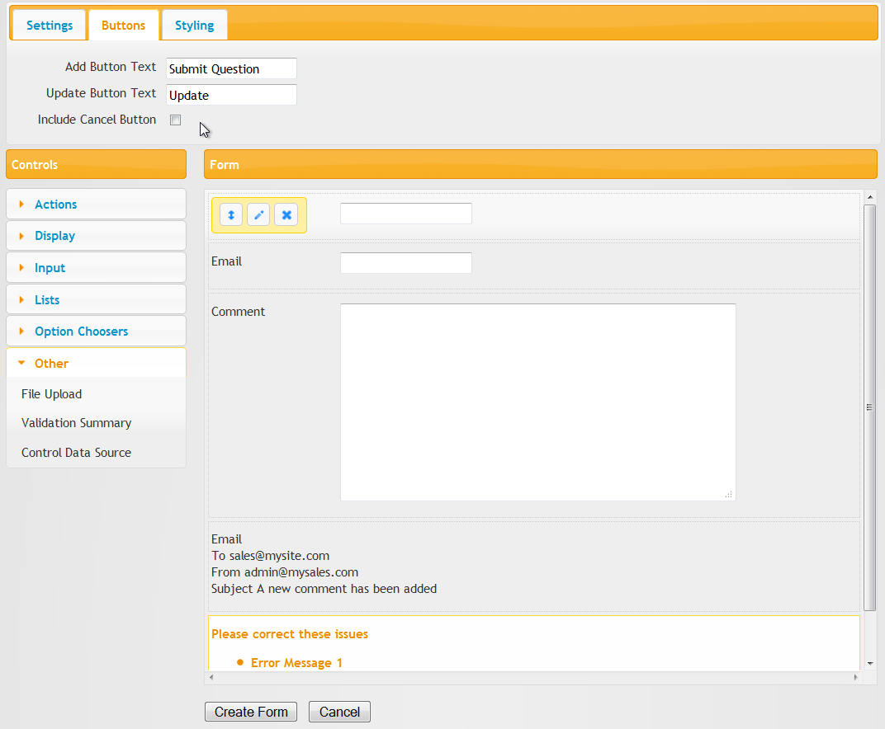
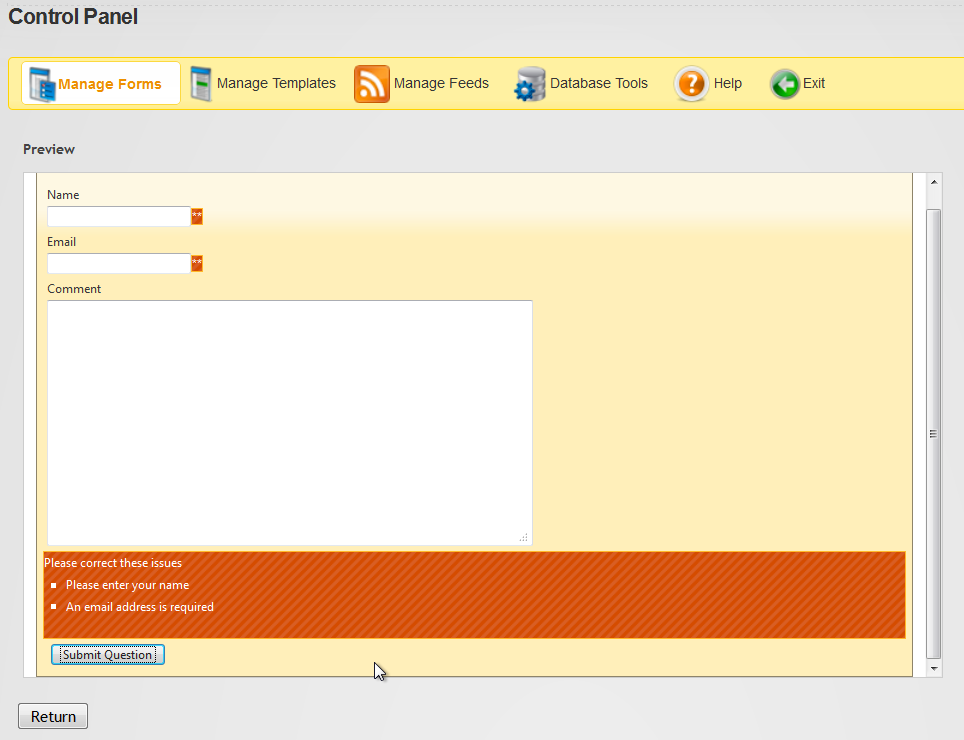

# Creating Forms with the Form Builder

::: tip NOTE
The FormBuilder was first introduced in version 2.x of XMod Pro.... Beginning with version 3, you'll find the FormBuilder on the ManageForms page. [It is described here](manage-forms.md)
:::

The Form Builder, introduced in version 2, provides you with a simple point, click, and drag interface that makes it easy to create attractive, styled data entry forms from the tables in your DNN database. .....You can also create basic forms on the Manage Forms page using the Quick Form Creator....... That option provides fewer options than the Form Builder. The Form Builder is available on the Control Panel and is only available to Host or SuperUser accounts. To get there, select "Control Panel" from the module's Actions Menu:

On the Control Panel Page, select "Manage Forms":

Then, ensure the "Use Form Builder" checkbox is ticked, and then click the New Form button:

Creating and editing attractive data-bound forms is a simple point-and-click affair. Some of the highlights are:

**Select DNN or External SQL Server as Your Data Source**: Form Builder allows you to work with tables in your DotNetNuke (DNN) database. as well as external SQL Server databases. All you need is the connection string.

**Auto Form Creation**: Quite possibly the most time-saving button on the planet. Once you’ve selected the table you want to work with, just click a button and the Form Builder will create your form. From there you can add, remove, and edit controls as you see fit.

**Populate List Controls With Data**: From within the Form Builder, you can load list controls with data in your databases. This enables you to create “picker” lists so your users can select from a pre-defined list of items – like a list of states or countries.

**Control Previews**: When you add a control to the form, you see an approximation of how it will look – including control type and dimensions.

**Drag and Drop Re-Ordering**: Just click and drag to change the position of a control within the form.

**Email Notification**: Need to send an email when the form is submitted? Just add an Email control to the form.

**Theme-able Forms**:You can use basic built-in DNN styles or easily add professional styling to your forms, simply by selecting a pre-defined theme from the built-in list of themes. Or, roll-your-own theme (also a point-and-click affair) and upload it to your site. It will show up in the list of themes as well, ready to be selected. This allows you to get exactly the look and feel you need to match your forms with the rest of your site.

**Easily Convert Your Forms**: Forms which are editable in the Form Builder are called Auto-Layout forms. However, with a single click, you can convert them to Custom HTML Layout forms which give you complete control over the HTML, CSS, and Javascript in your form.

To see the Form Builder in Action, here are some videos:

[XMod Pro Form Builder Demo (video)](http://dnndev.com/Learn/Videos/vid/9/video/XMod-Pro-Form-Builder-Demo)

[XMod Pro 3 Form Builder Tour - Contact Us Form (video)](http://dnndev.com/Learn/Videos/vid/5/video/XMod-Pro-Form-Builder-Tour-Contact-Us-Form)

[XMod Pro 3 - Creating Picker Lists in Your Forms (video)](http://dnndev.com/Learn/Videos/vid/4/video/Creating-Picker-Lists-in-Your-Forms)

**INTRODUCTION TO FORM BUILDER**:

Initially, you are presented with the following interface screen:

**Tabs**: At the top of the form, there are three tabs. In general, changes you make in these tabs apply to the form as a whole. The first tab "Settings" is where you set the forms name and choose its Data Source. The second tab "Buttons" enables you to modify the forms Submit and Cancel buttons. The third tab "Styling" allows you to apply some overall styling to your forms including themes, label placement, and rounded corners.

Below the tabs is the main work area of the Form Builder. In the left column is the Control picker. All of the form controls are categorized and grouped here. To see the controls in a particular category, simply click that category to expand it. To add a control to the form, click its button in the picker. Doing so will pop up that controls designer which allows you to set its most commonly used properties.

Example: TextBox Control Designer

**Controls and Form canvas**:

Once you've created your Controls, they'll be added to the Form canvas, shown in the right column. This is where you'll see and interact with controls you've already defined for your form. For each control, you'll get a basic approximation of how that control will look including its height and width. Not all controls are displayed in this manner. There are some complex controls like the HTML Input that cannot be rendered properly on the canvas and there are other controls that are not visible to the user at all and simply provide some functionality such as sending an email notification or supplying data to a List Control. These controls will still be represented on the canvas but don't reflect how or even if a control will be visible at run-time.

Once a control is on the form, hovering over it will display a toolbar. Using the toolbar, you can Edit the controls properties, Delete the control, and Move the control simply by clicking and dragging.

If you'd like to change the order that your controls appear in the form, you can simply click and drag the row to its new location.

**BUILD A FORM**:

To start, give your form a Name in the Form Name textbox.

Next, select DNN or External SQL Server as your Data Source (or None), from the drop-down list. The version 2 Form Builder allowed you to only work with tables in your DotNetNuke database. Version 3, and later enables you to select tables in external SQL Server databases. All you need is the connection string. If you select a Data Source, the Unique ID field list control will be populated with columns from the table. Select the column that uniquely identifies each record. This is needed by XMod Pro to generate commands and controls for editing records.The next step is to choose the column fields we want to include in the form. From the "Choose Fields" list box, select each column you want to include. Use CTRL-Click (CMD + Click on the Mac) to select multiple fields at once. Your screen should now look similar to this:

(**Note:** **Auto Form Creation**: Quite possibly the most time-saving button on the planet. Once you’ve selected the table you want to work with, just click a button and the Form Builder will create your form. From there you can add, remove, and edit controls as you see fit. )

Next, Select individual Controls. There are multiple controls which can be added. These include Actions, Display, Input, Lists, Option Choosers, and Others. For example, you can select a TextBox Control and edit the control properties:

**Add Validation**: To add validation to a control, click the plus sign, add the Required Field Validator as Validation Type, add Text which appears next to the control if the control fails, and a Message which will appear in the bottom of the form in the Validation Summary. Then, select Save, then Apply.

Email Notification Example: Need to send an email when the form is submitted? Just add an Email control to the form. When you assigned a Data Field to each control, this is where they are being used. You can see a Field Token for each control. They are surrounded by double brackets. In this way, it is easy to include data in your form into your emails.

**Buttons**: There are three button options on the form. The Add and Update Buttons can be renamed while the Cancel button can be included or removed from the form.

**Styling**: Next, you can choose some styling for your form. You have the option of basic DNN styling (the default), no styling, or one of many themes. A wide variety of themes are installed with XMod Pro. These themes are based on free, open-source jQuery UI theme framework available at [http://ui.jquery.com](http://ui.jquery.com/). Not only do these themes provide you with immediate, professional-looking styling, you can create from your own themes using the [jQuery UI Theme Roller](http://jqueryui.com/themeroller/) page.

To use a theme, simply select it from the drop-down list and see the effects in the Preview window. Note, it may take a couple of seconds for the theme to change initially while the new theme is downloaded to your computer. Subsequent previews with that theme will be faster. You can also select Label Alignment, Label Width, and whether to use rounded corners or not.

If you choose a theme, you can also choose to give your form rounded corners on modern browsers. In un-supported browsers, the corners will remain square. To round your corners, tick the "Use Rounded Corners..." check box next to the theme list. The Preview window will automatically reflect your changes. Not all themes have rounded corners and degree of "roundedness" varies on those that do. Also, if you're previewing in Internet Explorer, you may still see square corners.

When you are done, click the Create Form button. At that point, you can navigate to the Manage Forms screen to further edit your form (note, you may need to click the Reload button on the Manage Forms grid to see your new form).

Finally, if you've specified that certain fields are required, you can click the Add Button / Submit Question button to show how the validation will look:

**Easily Convert Your Forms**: Forms which are editable in the Form Builder are called Auto-Layout forms. However, with a single click, you can convert them to Custom HTML Layout forms which give you complete control over the HTML, CSS, and Javascript in your form.

If at any point, you need more features than the Form Builder provides, you can convert your form to a Custom html layout form and tweak the code to get just the look or functionality you require.

